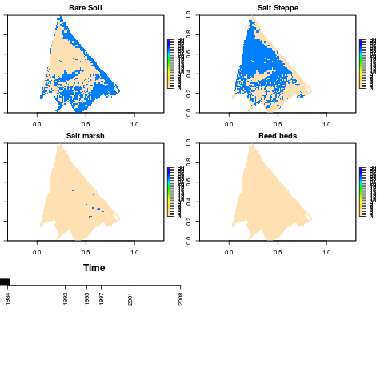

spdynmod
========

[](http://dx.doi.org/10.5281/zenodo.10624)

<a rel="license" href="http://creativecommons.org/licenses/by-sa/3.0/deed.en_US"></a><br />This work is licensed under a <a rel="license" href="http://creativecommons.org/licenses/by-sa/3.0/deed.en_US">Creative Commons Attribution-ShareAlike 3.0 Unported License</a>.

Development version of the R library Spdynmod: Spatio-dynamic wetland plant communities model

The stable version can be found on [CRAN](http://cran.r-project.org/web/packages/spdynmod/index.html)

## How to install the spdynmod R library

```
install.packages('spdynmod')
```

## How to install the development version of the library

```
library(devtools)
install_github('spdynmod',username='javimarlop')
```

## Animation of model results

Animation of model results based on default parameters.



## How to run the model

Please type `help(run_model)` for model execution options and `library(help=spdynmod)` to see all available functions in the library.

```
run_model()
```

## Model validation

A **mutiple resolution goodness of fit** assessment has been performed for each validation year after *Costanza 1989* and *Kuhnert et al. 2005*. We implemented the version modified by Kuhnert et al. in order to exclude NA values from the analysis. The maps and R script needed to perform this assessment, as well as the results, can be found under `inst/maps_validation`.

## How to cite this model library

```
citation('spdynmod')
```

## Supplementary material

### Online wetland and watershed maps

You can see the location map of the study wetland and its watershed area by clicking on the [wetland.geojson](https://github.com/javimarlop/spdynmod/blob/master/inst/extdata/wetland.geojson) and [watershed.geojson](https://github.com/javimarlop/spdynmod/blob/master/inst/extdata/watershed.geojson) files on the `/inst/extdata` folder.

### References

Costanza, R. (1989), 'Model goodness of fit: A multiple resolution procedure', Ecological Modelling  47(3--4), 199 - 215.

Kuhnert, M.; Voinov, A. & Seppelt, R. (2005), 'Comparing Raster Map Comparison Algorithms for Spatial Modeling and Analysis', Photogrammetric Engineering & Remote Sensing 71(8), 975--984.

[Martínez-López J.](http://webs.um.es/javier.martinez/miwiki/lib/exe/fetch.php?id=inicio&cache=cache&media=isem2013_jml.pdf), Martínez-Fernández J. , Naimi B., Carreño M. F., Esteve M. A. (2013), Spatio-temporal dynamic modeling of plant communities responses to hydrological pressures in a semiarid Mediterranean wetland. Ecological Modelling for Ecosystem Sustainability in the context of Global Change - ISEM 19th. Toulouse, France.

