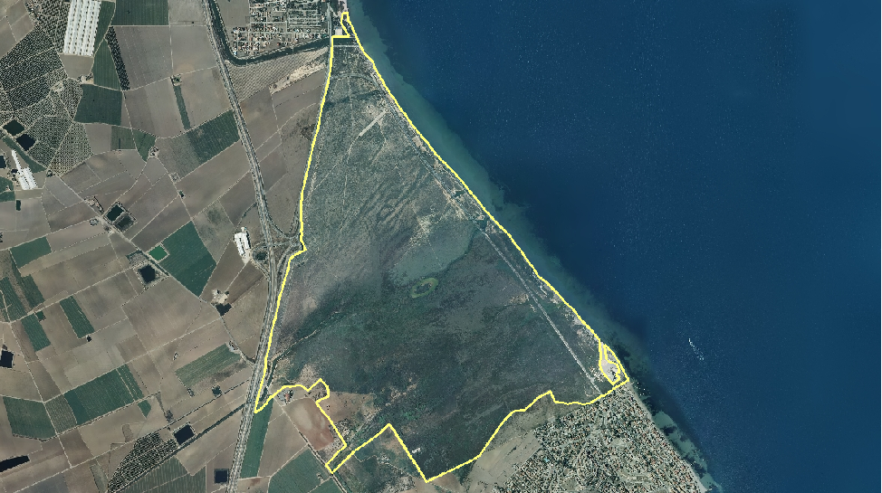
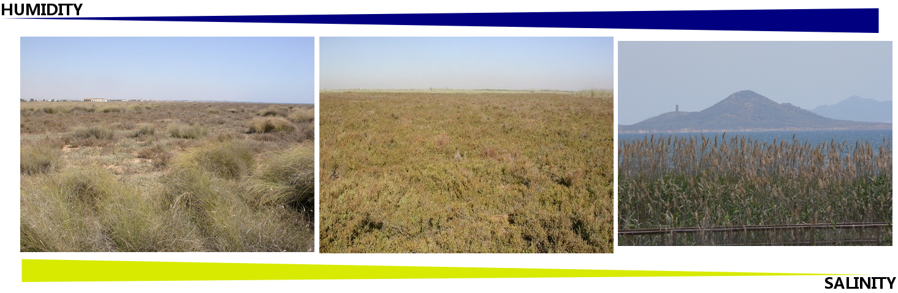

<!--
VignetteEngine{knitr::knitr}
VignetteIndexEntry{spdynmod}
-->

# Spatio-temporal dynamic model of plant communities responses to hydrological pressures in a semiarid Mediterranean wetland

## Introduction

### Study area


### Marina del Carmoli wetland (314 ha)




### Wetland plant communities

Semiarid Mediterranean saline wetlands are semi-terrestrial ecosystems



* Salt steppe (left) - priority habitat by the Habitats Directive
* Salt marsh (center) - habitat of interest by the HD
* Reed beds (right) ({it Phragmites australis) - invasive

### External water inputs

Percentage of irrigated areas has increased in the last decades due to the opening of a water transfer (Mart'inez-L'opez et al., in press)


### Plant communities change

Important plant communities are being lost!


Carreño et al., 2008; Mart'inez-L'opez et al., 2012


## Objectives

Spatially explicit wetland model of how irrigated agriculture is affecting plant community composition in this semiarid Mediterranean wetland:

* as a tool for wetland conservation and management studies
* to forecast the loss of important plant communities due to irrigation pressures

## Methods

### Modelling environment

R as a modelling environment:

* GIS capabilities
* source code is flexible
* free availabity and growing user community

### State variables

* Wetland is divided into pixels (25 m)
* Plant communities are modelled separately pixel by pixel (4 maps)

The total abundance of plant communities within a pixel is limited, so there is competition among plant communities mediated by:

* total drainge water input to the wetland
* spatial environmental variables influencing water availability and growth


### Initial and validation maps of plant communities

Model was tested by means of remote sensing data for the period 1992-2008


Carre~no et al., 2008; Mart'inez-L'opez et al., 2012

### Main variables and parameters

Flow from state variable A to B (per pixel)


Shaded squares represent non spatial variables/parameters and oval shaped variables refer to state variables.

### Model assumptions I

* Increasing water input
* Only conversion to more humid / less saline plant communities


### Model assumptions II

* invasive reed beds are potentially present in all pixels
* salt marsh is a native plant community type and is able to disperse into neighbour pixels


### Non spatial forcing input
Drainage water input: WARP index (Mart'inez-L'opez et al., 2014a,b)


### Wetland environmental spatial parameters

* (A) distance map to ephemeral river 1 (reed beds)
* (B) distance map to ephemeral river 2 (reed beds)
* (C) Flow accumulation map (salt marsh)


* All parameters are on a relative 0--1 scale.

### Model diagram


### Model development/execution

* Initial dynamic model was developed using Stella (1 pixel)
* Conversion to R using 'StellaR' script (Naimi and Voinov, 2012)
* State variables and spatial environmental variables as matrices
* Model wrapped as a R function
* ode.2D("euler" method, time = 24 year, TS = 0.25) {small (library "deSolve")


## Results
 
Spatial overall Accuracy: 54 -- 71


### Simulated total area of each plant community


Dots represent the are occupied by each plant community based on RS data and model simulated values are represented by lines

### Error and similarity measures of plant communities abundance

```
PC    r NRMSE   EF
SS 0.91    44 0.77
SM 0.84    54 0.65
RB 0.88    53 0.65
```

* 'r' corresponds to the Pearson correlation coefficient ($P < 0.05$)
* 'NMRSE' to the normalized root mean squared error
* 'EF' to the efficiency factor.

## Conclusions

The model serves as a tool for:

* wetland conservation and management studies (habitat loss)
* testing plant community interactions
* testing relationships between plant communities and environmental variables in space and time

The library needs further developments in order to become a flexible tool for the development of new spatio-dynamic models
